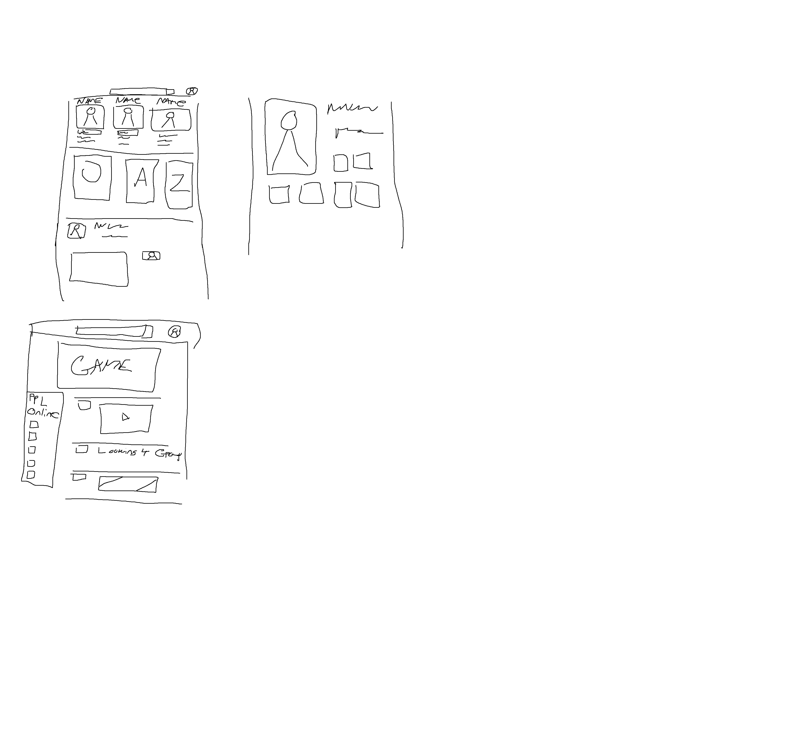

# Room-5
For group work with Kevin, Isain, Daniel, and Ayoub.


## User Story
``` md
AS A developer with an interest in gaming
I WANT a website that can connect me with people who have similar interests
SO THAT I can have a sense of community and make new connections
```
## TO-DO
- Project Pitch(User Story) ✔
- Technologies being used ✔
- database ERD ✔
- The steps needed to create the project ✔
- A link to the repo with everyone having access ✔
- Basic Wire Frame ✔

### Steps
- Group up ✔
- Concept/idea for project ✔
- Webpage layout
- Database set up
- Server set up
- heroku transer
- set up presentation

### Basic Wire Frame



### Github Repo

[https://github.com/Jack41400/Room-5.git](https://github.com/Jack41400/Room-5.git)

### TECH
- node
- express
- insomnia
- mysql
- heroku
- steam api?
.
